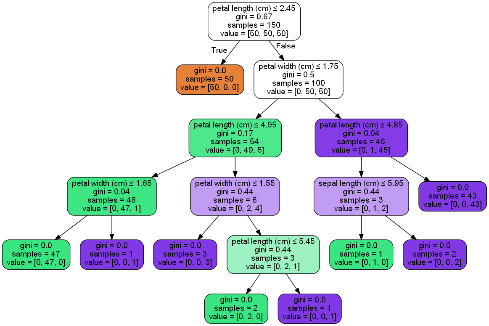

# Implementing a Machine Learning Algorithm, from DataSet to Production

Data science is a **HUGE** field. We're not going to cover it 
here. Not even close. However, if you come from a software 
engineering background it does give an overview of the life 
cycle of data science, from which you can research in greater 
detail. Having gone through this learning curve myself, I can 
attest to how bewildering the entire field can be at first and 
being able to see the _'big picture'_ is essential if you want 
to know where to even start.

The following is a very basic tutorial designed to go through 
the process of designing a simple machine learning algorithm and
translating it it to code that can be deployed in production. 
It can be used as a model for a software engineer to develop 
their own ML algorithms for production and/or also a starting 
point to better explore the field of data science.

For the purposes of this tutorial, I will be using Python, along 
with the <a href="http://scikit-learn.org/stable/">Scikit-Learn</a>,
to produce a final artifact which is a Java class that 
may be integrated into a software application.

To set up your development environment and import the necessary
Python packages, I recommend the following tutorial 
<a href="https://github.com/BurntSushi/nfldb/wiki/Python-&-pip-Windows-installation">here</a>.

### Preparing your Data

This is potentially the most labour intensive part of data 
science. For data to be usable, it must be both _clean_ and 
_meaningful_ - that it, it must not contain content (or lack
thereof) that will negatively affect the effectiveness of your
model, and should include data that is relevant to identifying
your target. Such data types are called features and will 
ultimately become the inputs to our finished model.

In practice it has been observed that while some model times 
will work better than others, depending on the problem to be 
solved, the quality and quantity of the training data is 
ultimately king.

_Feature engineering_ is the term to describe how meaningful 
data of this type is extracted from a raw dataset and prepared 
for use in a prospective model and is deserving of not simply
another tutorial, but probably a series of them.

And of course some of your data will need to be extracted so 
you can test your model - which gets us into into _supervised_
and _unsupervised_ learning. And _semi-supervised_...

Basically, I think you get the picture at this stage. There's 
a lot there and this tutorial isn't going to cover it all as 
there are plenty of much better tutorials out there that do
this.

So we're going to cheat a little and use the _IRIS dataset_, 
which comes bundled with _Scikit-Learn_, already cleaned and 
features prepared and ready for use. The aim is to create an
algorithm that allows us to identify which species of Iris 
flower is being observed based upon features such as petal 
length.

Thus first we import our conveniently prepared dataset and 
assign the information we will be using to variables.

```python
# Import Prepared DataSet

import sklearn.datasets as datasets

iris = datasets.load_iris()
features = iris.feature_names
data = iris.data
target = iris.target
```
As you can see, we load the data and extract the information that
will allow us to generate our model; the features (those variables
that we will use as inputs), the target (the species that we want
to predict) and the data itself (from which the algorithm will be
generated).

### Generating the Model

There are a bewildering number of different machine learning 
model types out there, each with their own purposes, advantages 
and disadvantages.

Good news it you don't need to write any. They're available as 
libraries for many languages, in particular Python and R, which
are most common in the field of data science. You could go out 
and develop your own from scratch, in theory, but unless you
have spent years immersed in mathematics and statistical 
research it's unlikely you'll develop anything better.

In practical terms the best way to optimize your model is by
using the right model and the most optimized data and features.
Some models are better at categorizing data, some are recursive
and designed to continually learn as they operate, while others
require you rebuild the model with new data every time you 
update them. Others are desined to work with images. Others
again with natural language. In short even if dependant on
model types developed by others, there is still considerable
scope to optimize what you are developing.

It should be noted that for more advanced models, particularly
_neural networks_, Scikit-Learn is probably not the best
package. For those, I would recommend looking into
<a href="https://github.com/tensorflow/tensorflow">Tensorflow</a>
or <a href="https://keras.io/">Keras</a>.

Again, going into detail on this is outside the scope of this
tutorial and so, for we're going to use one of the most simple 
model types in machine learning - a decision tree classifier.
Essentially, it can be described as a nested series of if/else 
conditionals that use criteria that have been mined or learned 
from your dataset to reach a final result.

The Scikit-Learn code is very simple and as follows:

```python
# Generate Decision Tree Classifier Model

import pandas as pd
from sklearn.tree import DecisionTreeClassifier

dtree = DecisionTreeClassifier()
dtree.fit(pd.DataFrame(data, columns=features), target)
```

While there are numerous paramaters you can use to _tweek_ your
model, that's essentially all there is to it with Scikit-Learn 
or pretty much all other machine learning packages out there 
nowadays.

### Exporting the Model for Production

This is where many tutorials on machine learning tend to trail
off, I've noticed. We've generated our machine learning model 
and, well, how do we export it into some format we can use in
a practical fashion.

In reality this is quite dependant on the model type used and 
the package or library used to generate it, but I'll cover a
few basic approaches here.

#### Scikit-Learn and Pydotplus

Scikit-Learn comes with various tools that allow you not only
to generate and customise a model, but also to export it.
<a href="http://pydotplus.readthedocs.io/">Pydotplus</a> is an
advanced graphing tool that can be used with Scikit-Learn, 
giving you the option to graphically represent your model, as
follows.

```python
# Sklearn and Pydotplus

import pydotplus
from sklearn.externals.six import StringIO
from sklearn.tree import export_graphviz

dot_data = StringIO()
export_graphviz(dtree, out_file=dot_data, feature_names=features, precision=2, filled=True, rounded=True, special_characters=True)
graph = pydotplus.graph_from_dot_data(dot_data.getvalue())
graph.write_png('../output/tree.png')
```

This produces the following PNG image in the output directory.



From this it would be possible to extract the necessary logic
to write the business logic in any software language. As I
mentioned earlier, we're using a decision tree classifier,
which is just a nested series of if/else conditionals that 
have been mined or learned from your dataset to reach a final 
result. This means, from even just this graphical 
representation we could (using C) write the first node of the 
derived algorithm as: 

```c
#include <stdlib.h>
#include <stdio.h>
#include <math.h>

int predict(float petal_width, float petal_length, float septal_width) {

    int iris_types[3];
        
    if (petal_length <= 2.45) {
        iris_types[0] = 50; 
        iris_types[1] = 0; 
        iris_types[2] = 0; 
    } else {
        // Go through all the other nodes
    }

    int index = 0;
    for (int i = 0; i < 3; i++) {
        index = iris_types[i] > iris_types[index] ? i : index;
    }
    return index;
}
```

Naturally this is not an idea way of exporting your model, and 
also can not be done for all model types (for example values 
are rounded to two decimal places), however I have included it 
to give a better understanding of what a model ultimately is 
and how it can be exported for use in production code.

For that you can access the model directly to give you the
necessary information using the data directly from `graphviz`,
which will write a file containing the relevant modal data.

```python
# Modal Data Export using Graphviz

export_graphviz(dtree, out_file='../output/model.dot', feature_names=features, precision=10, special_characters=True)
```

Note the different value for `precision` here. This is because
it is not simply precision in terms of visible decimal points,
but number of digits of precision for floating point in the 
values of impurity, threshold and value attributes of each 
node.

#### Sklearn-Porter

<a href="https://github.com/nok/sklearn-porter">Sklearn-Porter</a>
is a python library that is designed to export a model and
generate the code implementing in in Java, C and a number of 
other languages.

For example, the code below will export our model to a Java
class that we can easily incorporate in any Java application.

```python
# Sklearn-Porter Export

from sklearn_porter import Porter

porter = Porter(dtree, language='java')
output = porter.export(embed_data=True)
file = open('../output/code.java', 'w')
file.write(output)
file.close()
```

Of note is the export option of `embed_data`. If set to `True`
it will export a the nested if/else code we've discussed. If
False, it will export a more dynamic output where the number of
decision nodes and their values are not hard coded - less 
human readable, but can be updated with greater ease.

#### Other Export Formats

The above are largely specific to `DecisionTreeClassifier` in 
Scikit-Learn. Other machine learning APIs, frameworks and 
libraries may vary, and there are also a number of standards
that have been adopted to decribe models, such as the 
Predictive Model Markup Language (PMML), but ultimately you
can always export models - they would not be of much use if you
could not.

### Conclusions

And there you have it. All you need to develop and deploy a
machine learning algorithm in a software project. With little
modification you could probably adapt the code above to
produce numerous models for production, however it is ultimately
only meant as an introductory overview of how to do so.

As I began this tutorial, data science is a **HUGE** field and
while I hope this tutorial gives you a good jumping point into
the field, different use cases will require approaches that
will deviate from this and require a significant amount of
additional research. However, having being introduced to the
landscape, you should now be able to navigate through that 
research with greater ease.
